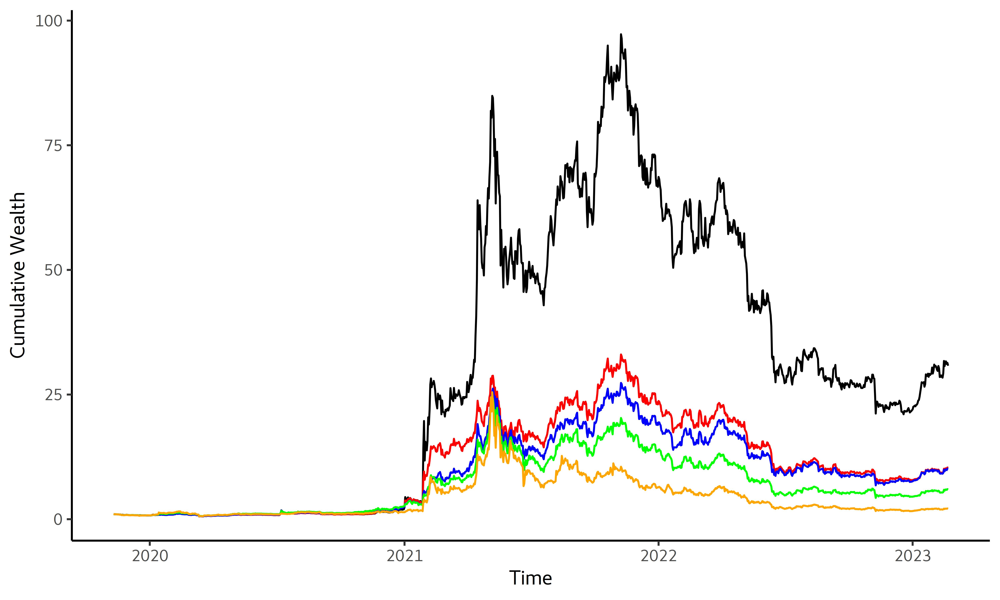

## [](http://quantlet.de/) **SRMforDA_PowerL1** [](http://quantlet.de/)

```yaml

Name of Quantlet:    'SRMforDA_PowerL1'

Published in:        'Spectral Risk for Digital Assets'

Description:         'This Quantlet calculate weights of minimum Power SRM porfolio with 0 < gamma < 1 and performance statistics'

Keywords:            'Power SRM, spectral risk measures, portfolio, performance, Turnover, Target Turnover, Cumulative wealth, SD, Sharpe ratio, Calmar Ratio'

Author:              Matúš Horváth

```



