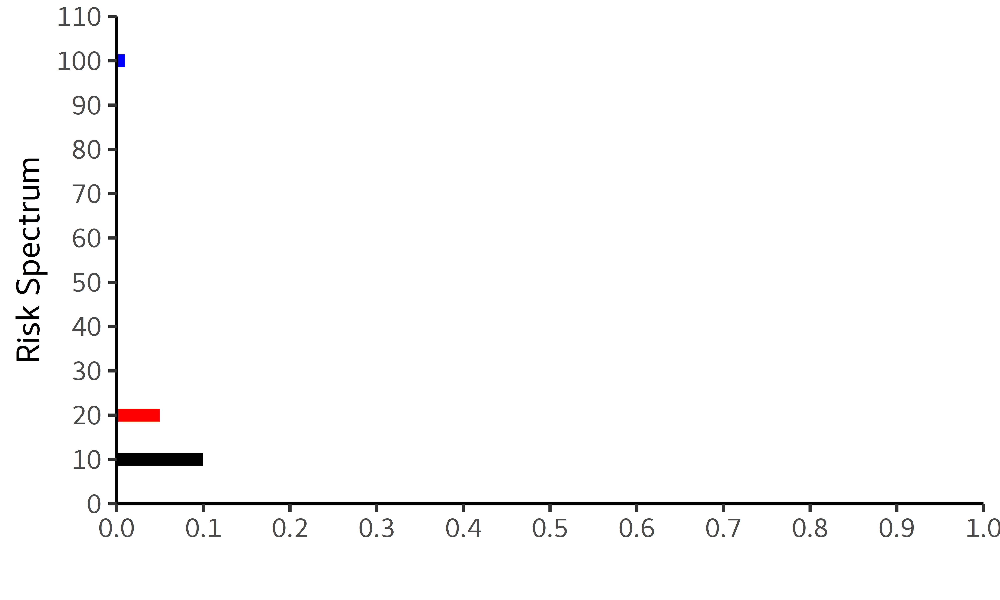
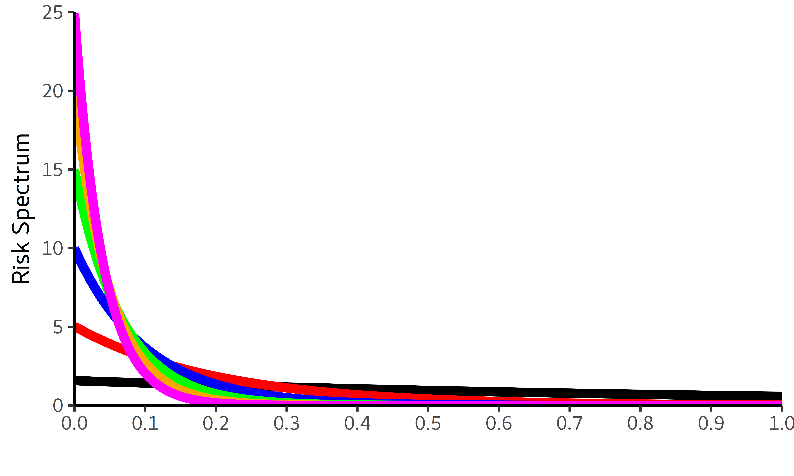
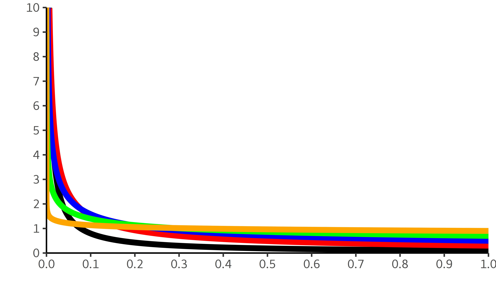
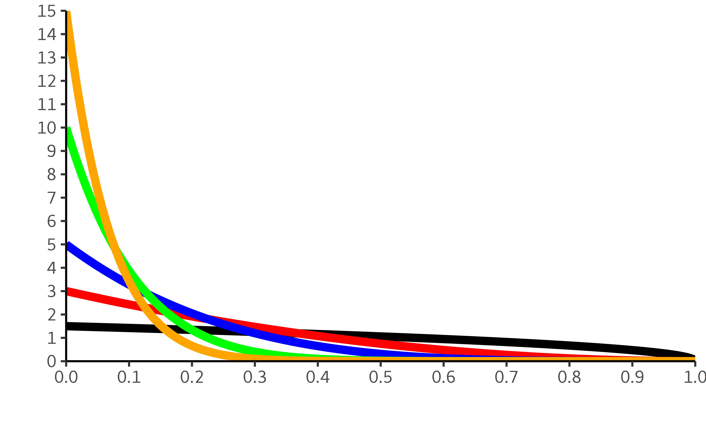

## [](http://quantlet.de/) **SRMforDA_RiskSpectrum** [](http://quantlet.de/)

```yaml

Name of Quantlet:    'SRMforDA_RiskSpectrum'

Published in:        'Spectral Risk for Digital Assets'

Description:         'This Quantlet makes figures showing Risk Spectrum for ES, Exponential SRM and Power SRM'

Keywords:            'SRM, Spectral risk measure, risk spectrum, expected shortfall, exponential SRM, power SRM'

Author:              Matúš Horváth

```








