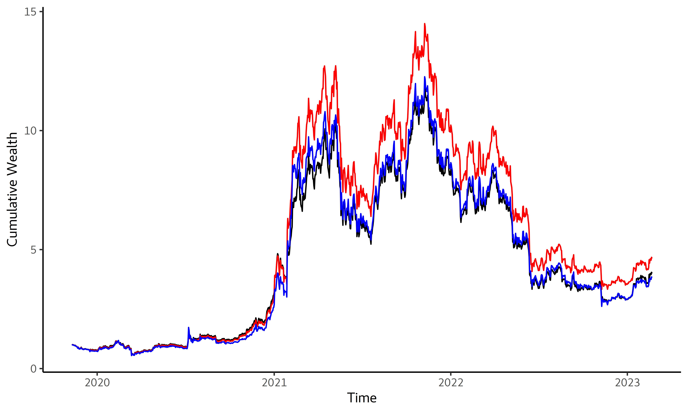

## [](http://quantlet.de/) **SRMforDA_VaRES** [](http://quantlet.de/)

```yaml

Name of Quantlet:    'SRMforDA_VaRES'

Published in:        'Spectral Risk for Digital Assets'

Description:         'This Quantlet calculate weights of minimum VaR and ES porfolio and performance statistics'

Keywords:            'Value-at-Risk, Expected Shortfall, portfolio, performance, Turnover, Target Turnover, Cumulative wealth, SD, Sharpe ratio, Calmar Ratio'

Author:              Matúš Horváth

```



