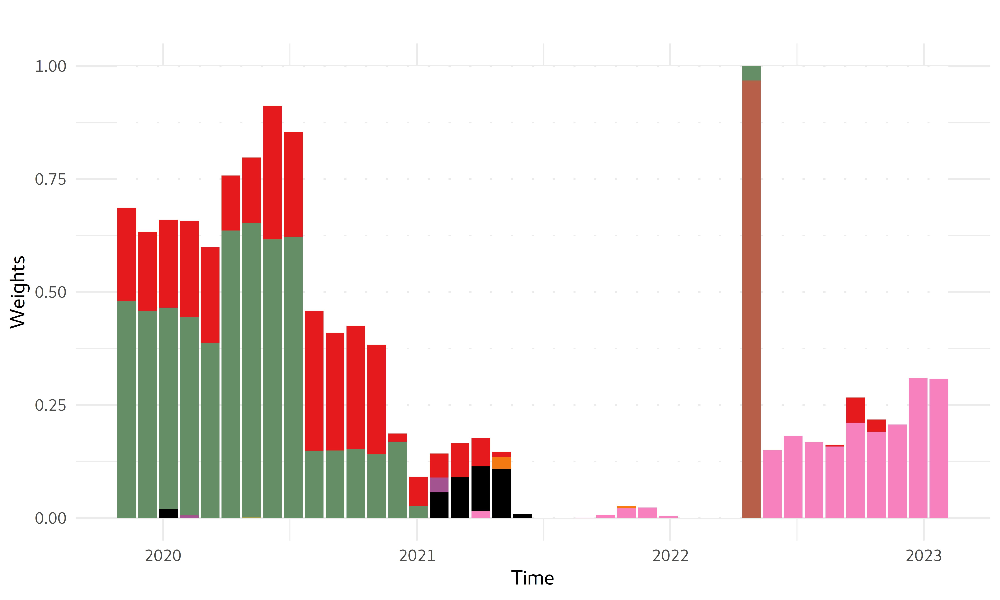
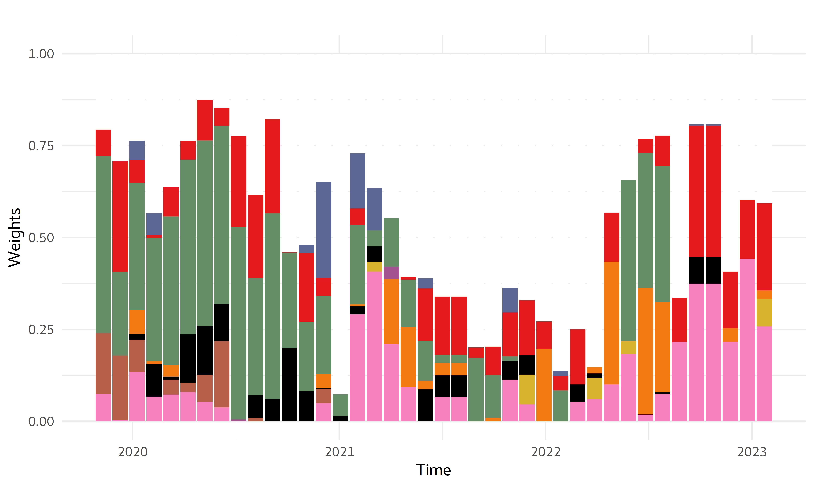
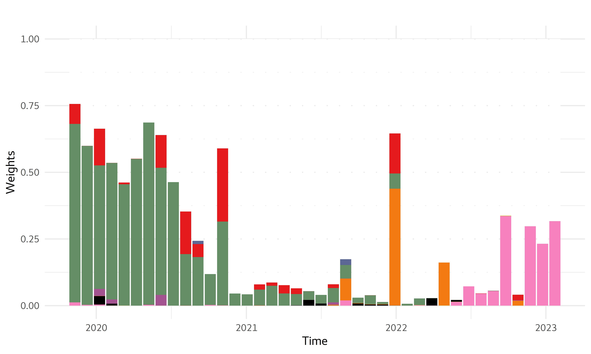
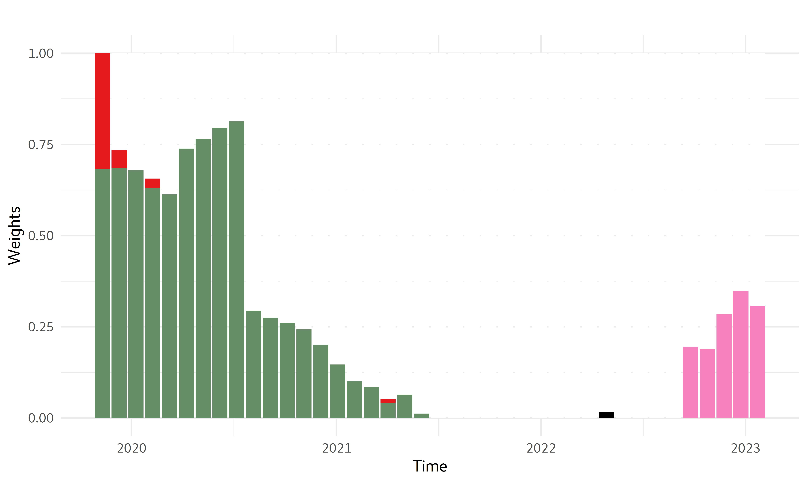
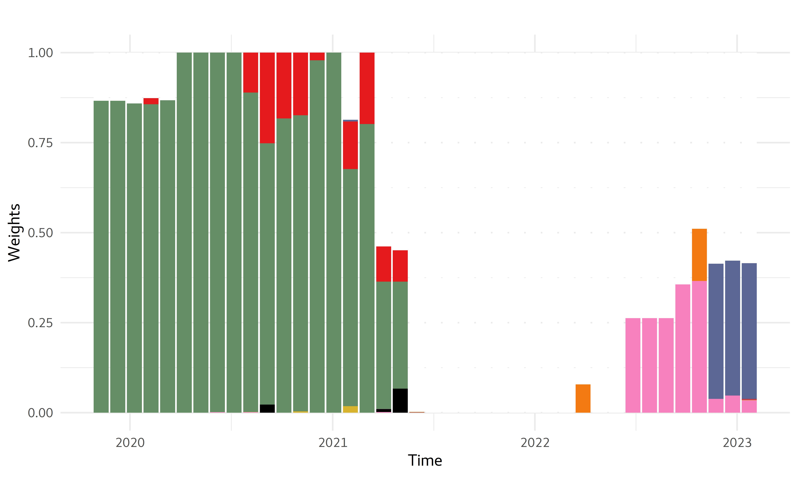
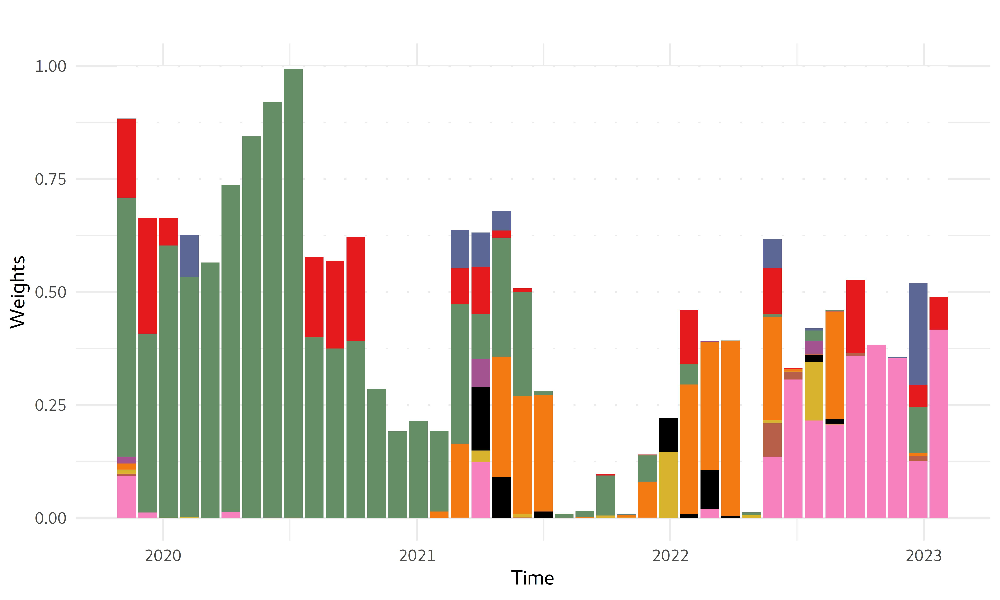
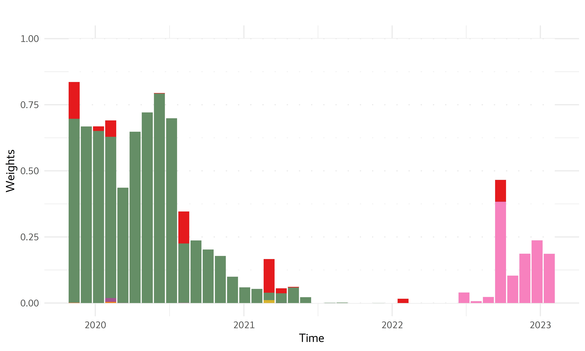
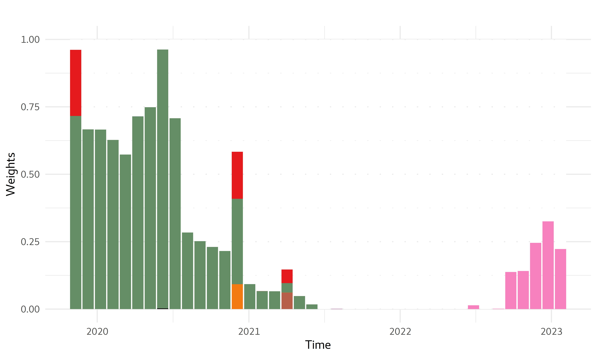

## [](http://quantlet.de/) **SRMforDA_Weights** [](http://quantlet.de/)

```yaml

Name of Quantlet:    'SRMforDA_Weights'

Published in:        'Spectral Risk for Digital Assets'

Description:         'This Quantlet makes weights figures from Appendix B'

Keywords:            'SRM, Spectral risk measure, weight plot, expected shortfall, exponential SRM, power SRM, MinVar, Naive'

Author:              Matúš Horváth

```















