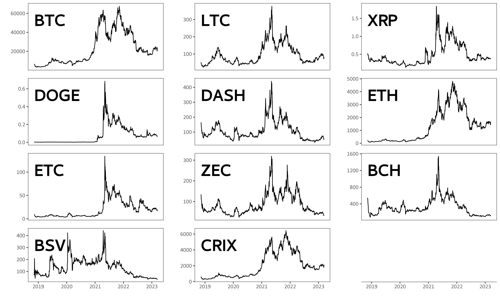

## [](http://quantlet.de/) **SRMforDA_descriptive** [](http://quantlet.de/)

```yaml

Name of Quantlet:    'SRMforDA_descriptive'

Published in:        'Spectral Risk for Digital Assets'

Description:         'This Quantlet calculate descriptive statistics for data used in papaer Spectral Risk for Digital Assets'

Keywords:            'descriptive statistic'

Author:              Matúš Horváth

Dataset:             coinPrice.qs

```

